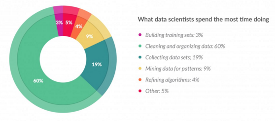
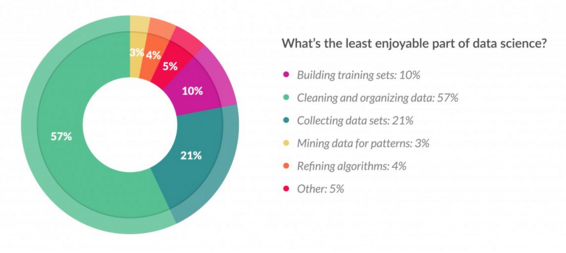
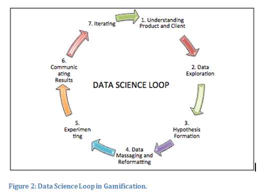
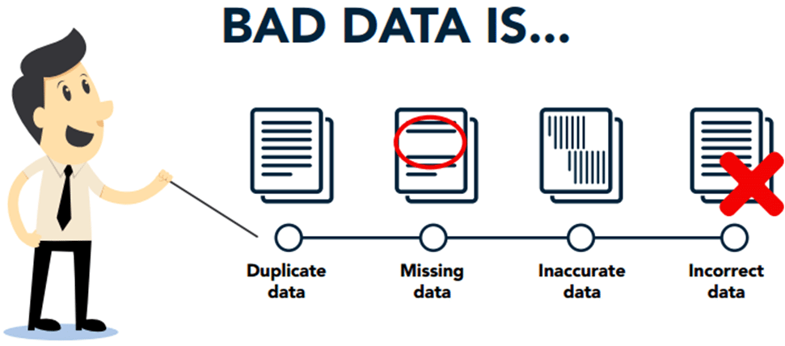
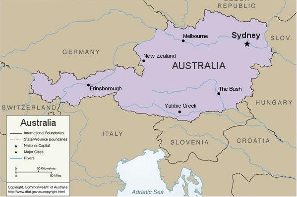

Ostatnie spotkanie STWURa w tym roku poprowadził Bartosz Kolasa - data scientist z firmy PiLab, a zorganizował Jarosław Chilimoniuk. Zachęcamy do zapoznania się z materiałami.

## Materiały

<https://github.com/STWUR/eRementarz3>

## Co robi Data Scientist?



## Czego nie lubi Data Scientist?



## Wielokrotna iteracja



## Ekspolaracyjna analiza danych (EDA)

"Procedures for analyzing data, techniques for interpreting the results of such procedures, ways of planning the gathering of data to make its analysis easier, more precise or more accurate, and all the machinery and results of (mathematical) statistics which apply to analyzing data."

John Tukey

## Brudne dane


```{r echo=FALSE, include=FALSE}
library(dplyr)
```


## Dane niepełne

```{r}
library(titanic)
library(dplyr)
titanic_train %>% filter(is.na(Age)) %>% head
```

## Dane niepoprawne

- dane spoza oczekiwanego zakresu
- niepoprawne kombinacje danych



## Dane niespójne


## Dane niezintegrowane


## Typy danych

```{r}
str(titanic_train)
```


## Uwaga na zmienne czynnikowe

```{r eval=FALSE}
read.csv("myfile.csv", stringsAsFactors = FALSE)
```

## Macierz odpowiedniości
```{r}
table(titanic_train$Survived)
```

## Macierz odpowiedności

```{r}
table(titanic_train$Sex, titanic_train$Survived)
```

## Procentowo

```{r}
prop.table(table(titanic_train$Sex, titanic_train$Survived))
# table(titanic_train$Sex, titanic_train$Survived) %>% prop.table
prop.table(table(titanic_train$Sex, titanic_train$Survived), margin=1)
```

## Czy zmienne są zależne?
```{r}
chisq.test(titanic_train$Survived, titanic_train$Sex) -> chsq
chsq$observed
chsq$expected
```

## Która kombinacja zaburza najbardziej?
```{r}
chsq$residuals
chsq$p.value
```

## Mniej widoczne
```{r}
titanic_emb <- dplyr::filter(titanic_train, Embarked != "")
chisq.test(titanic_emb$Survived, titanic_emb$Embarked) -> chsq
chsq$observed
chsq$residuals
chsq$p.value
```

## Więcej wymiarów
```{r}
with(titanic_train, ftable(Survived, Sex, Embarked))
```

## Pakiet DescTools

```{r}
library(DescTools)
Desc(titanic_train$Survived, plotit=FALSE)
```

## Wykresy
```{r}
Desc(titanic_train$Survived, plotit=FALSE) -> d
plot(d)
```


## Więcej kategorii

```{r}
Desc(titanic_train$Embarked, plotit=FALSE)
```

## Wykresy
```{r}
Desc(titanic_train$Embarked, plotit=FALSE) -> d
plot(d)
```

## Zmienna ciągła

```{r}
Desc(titanic_train$Age, plotit=FALSE)
```

## Wykresy
```{r}
Desc(titanic_train$Age, plotit=FALSE) -> d
plot(d)
```

## Formuły

```{r}
Desc(titanic_train$Survived ~ titanic_train$Age, plotit=FALSE)
```

## Formuły
```{r}
Desc(titanic_train$Survived ~ titanic_train$Age, plotit=FALSE) ->d
plot(d)
```

## Formuły

```{r}
Desc(titanic_train$Age ~ titanic_train$Survived, plotit=FALSE)
```

## Formuły
```{r}
Desc(titanic_train$Age ~ titanic_train$Survived, plotit=FALSE) ->d
plot(d)
```

## Rozkład długoogonowy

```{r}
Desc(log10(titanic_train$Fare), plotit=FALSE)
```

## Rozkład długoogonowy
```{r}
Desc(log10(titanic_train$Fare), plotit=FALSE) ->d
plot(d)
```

## Rozkład długoogonowy

```{r}
library(dplyr)
titanic_nozero <- mutate(titanic_train, Fare=na_if(Fare,0))
Desc(log10(titanic_nozero$Fare), plotit=FALSE)
```

## Rozkład długoogonowy
```{r}
Desc(log10(titanic_nozero$Fare), plotit=FALSE) ->d
plot(d)
```

## Szybki sposób na outliery
```{r}
library(outliers)
titanic_train %>%
  filter(!is.na(Age)) %>% 
  mutate(score=scores(Age, type="iqr")) %>%
  select(Name,Age,score) %>% arrange(desc(score)) %>% head
```


## Podziękowania

Dziękujemy firmie Kruk SA i Wydziałowi Biotechnologii UWr za wspieranie spotkań STWURa.


